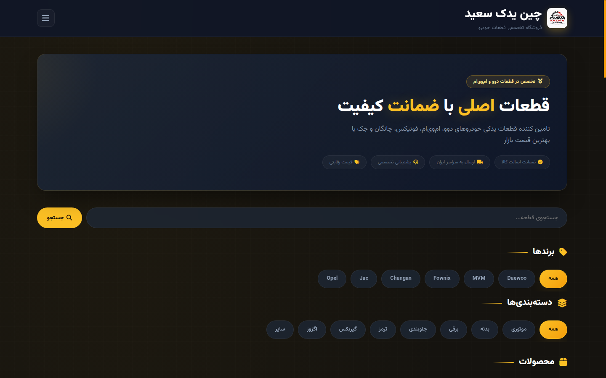

<div align="center">

# 🚗 چین یدک سعید

### فروش آنلاین قطعات خودرو

**یک وب‌سایت اختصاصی برای معرفی و فروش قطعات خودرو**

<br>

<a href="https://chinayadaksaeid.ir">
  
</a>
&nbsp;


</div>

---

## ✦ درباره پروژه

**چین یدک سعید** یک وب‌سایت اختصاصی در حوزه **فروش قطعات خودرو** است که برای ایجاد یک حضور حرفه‌ای در فضای آنلاین و ارائه محصولات به مشتریان توسعه داده شده است.

این پروژه با استفاده از **PHP** در بخش Backend و فناوری‌های استاندارد وب در بخش Frontend پیاده‌سازی شده و به‌صورت واقعی روی وب منتشر شده است.

---

## 🛒 حوزه فعالیت

تمرکز اصلی این پروژه روی ارائه و فروش قطعات خودرو است.

ساختار وب‌سایت با هدف:

- معرفی محصولات
- ارائه قطعات خودرو
- ایجاد دسترسی آنلاین برای مشتریان
- ارائه اطلاعات کسب‌وکار
- ایجاد یک بستر مناسب برای فروش آنلاین

طراحی شده است.

---

## ✨ ویژگی‌های پروژه

- 🚗 فروش قطعات خودرو
- 📦 نمایش و معرفی محصولات
- 🛒 ساختار فروشگاهی
- 🇮🇷 رابط کاربری فارسی
- 📱 طراحی واکنش‌گرا
- ⚙️ Backend مبتنی بر PHP
- 🔐 HTTPS / SSL
- 🌐 دامنه اختصاصی
- 🎨 رابط کاربری اختصاصی
- 🚀 استقرار روی هاست واقعی

---

## 🧱 ساختار فنی

```text
Web Application
│
├── Frontend
│   ├── HTML5
│   ├── CSS3
│   └── JavaScript
│
├── Backend
│   └── PHP
│
└── Deployment
    ├── Web Hosting
    ├── HTTPS / SSL
    └── Custom Domain
```

---

## 🛠️ Tech Stack

| بخش | فناوری |
|---|---|
| Backend | **PHP** |
| Frontend | HTML5 · CSS3 · JavaScript |
| UI | Responsive Web Design |
| Language | Persian / RTL |
| Deployment | Web Hosting |
| Security | HTTPS / SSL |
| Version Control | Git · GitHub |

---

## 🎯 هدف پروژه

هدف این پروژه ایجاد یک وب‌سایت واقعی برای یک کسب‌وکار فعال در حوزه قطعات خودرو و فراهم‌کردن یک مسیر آنلاین برای معرفی و فروش محصولات است.

تمرکز پروژه روی ترکیب سه بخش اصلی بوده است:

**محصول → تجربه کاربری → حضور آنلاین**

---

## 🌐 وب‌سایت

### Live Website

https://chinayadaksaeid.ir

---

## 📸 Preview

<div align="center">



</div>

## 👨‍💻 توسعه‌دهنده

### Mohammad

**Web Development · PHP · Python · Backend · AI**

🌐 Website:  
https://mohammaddev.gt.tc

💬 Telegram:  
https://t.me/mrmohammad_dev

---

<div align="center">

### 🚗 China Yadak Saeid

**Built for a real-world business.**

</div>
